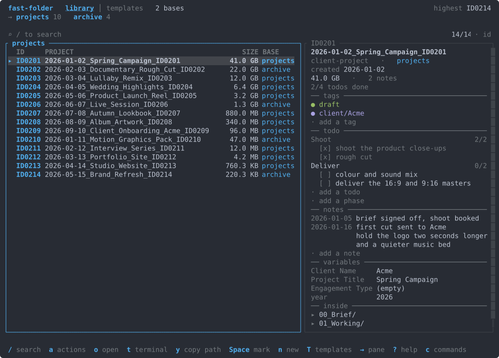

<h1 align="center">fast-folder</h1>

<p align="center"><b>A project folder creator and manager, with a full terminal interface and a full command line.</b></p>

<p align="center">
  <a href="https://github.com/cristocola/fast-folder/actions/workflows/ci.yml"></a>
  <a href="https://github.com/cristocola/fast-folder/releases"></a>
  <a href="https://aur.archlinux.org/packages/fast-folder"></a>
  <a href="LICENSE"></a>
  <a href="https://www.rust-lang.org/"></a>
</p>

If you work with many projects and many clients, you end up managing a lot of folders and files. fast-folder gives you one place to create them and one place to find, open, move and copy them afterwards.

You describe a folder structure once as a template. Every project you make from it comes out the same way: a consistent name, the subfolders you always need, starter files with your answers already written inside them, a unique ID, and a small metadata file that lets you find the project again months later.

Day to day you work in a full screen terminal app that shows your whole library at once and acts on it. Everything the app can do also has a command, so the same work fits into a script, a cron job, or a hotkey on your desktop. The command is `fastf`.

<p align="center"></p>

## Quick start

```bash
# Any Linux: downloads the binary and puts it on your PATH
curl -fsSL https://raw.githubusercontent.com/cristocola/fast-folder/main/packaging/linux/install.sh | sh

# Arch Linux
paru -S fast-folder-bin

# Your first project
fastf                        # pick a template, fill the form, done
```

Two templates are installed on first run. `general` is ready to use straight away and gives you a dated, numbered folder with an inbox inside it. `client-project` adds working and delivery folders plus a brief that fills itself in with the client's name and the project details.

More templates for specific kinds of work live in the [`examples/templates/`](examples/templates/) gallery: `music-video`, `photography`, `video-production`, `rust-project`, `python-project`, `web-project`, `finance-monthly` and `research-note`. Copy any folder into your own templates directory to adopt it, then edit it to match how you work.

## What it does

- **Creates a whole project from a template.** One template describes the folder tree and the starter files. Answering a few questions produces the folder, the subfolders, and files with your answers written into them: a brief with the client's name in it, a shot list titled for the artist, a report header with the right month, a config ready to build. Text files get their placeholders filled in, and binary files such as a logo or a video asset are copied byte for byte.
- **Finds any project again.** Every project carries a unique ID, a creation date, tags and searchable metadata. `fastf open ID0047` opens the folder, and so does `fastf open 47` or `fastf open lullaby`. In the terminal app the list narrows as you type, matching a name, an ID, a template or a tag, and a typo still finds the project. Precise filters work in both places: `fastf search template=music-video tag:draft created>2026-01-01`.
- **Stays quick on a large library.** The list appears before a single folder has been measured. Folder sizes are walked on background threads, two at a time, starting with the row you are on, and each one fills in where it belongs as it arrives. Each base keeps a small index beside its projects, so opening the app reads one file instead of walking every drive, and the index rebuilds itself from the folders whenever the two disagree.
- **Holds projects on several drives at once.** You can have different project bases for different reasons. For example a fast internal drive for current work, an external drive for archived projects, a network share, or a folder that another operating system on the same machine also mounts. Point fast-folder at each of them and they become one library, with a column that says which base a project is on. When a drive is unplugged, its projects are skipped, and they come back when you plug it in again.
- **Moves and copies projects safely.** `fastf move` uses a filesystem rename when both ends are on the same drive, which takes the same instant however large the folder is. Across drives it copies every ordinary file, verifies every path, type and byte length against a manifest, confirms the source is unchanged, publishes the destination with an atomic rename, and removes the source after that. `fastf copy-to` does the same work and keeps the original, which is how a project goes onto a backup drive with its ID intact.
- **Opens projects in the tools you already use.** Reveal a folder in your file manager, open a terminal inside it, put its path on the clipboard, or print the path on stdout for `cd "$(fastf path api)"`. Bind fast-folder to a hotkey on your desktop and it opens a terminal for itself when a question needs an answer.
- **Keeps the filesystem as the single source of truth.** A folder is a project because it contains a `PROJECT_INFO.md` file. Move it with your file manager, rename it, or copy it to another drive, and it stays the same project; `fastf reindex` picks up whatever you did outside the app. Delete the folder and the project goes with it.
- **Adopts folders you already have.** `fastf register` writes the metadata into work that came from somewhere else, one folder at a time or a whole directory at once. `fastf apply` adds a template's missing folders and files to a folder that already exists.
- **Reads a template out of a finished project.** `fastf template from-folder` looks at a project you are happy with and writes the template that would produce it.
- **Keeps a record of each project.** Tags group projects across templates and bases, and every project has a timestamped journal for the notes that belong with the work.
- **Runs your own steps after creating a project.** It can open the new folder, start your editor, initialize a git repository, or run any command you give it.
- **Works on Linux and Windows.** Templates use `/` on every platform. Paths are checked before anything is written, so a template can only ever produce files inside the project it belongs to.

fast-folder is a tool for one person, working on ordinary files and directories on one computer. It reads and writes files on the machine it runs on. The terminal app and the command line share the same configuration, templates and counters, so the two stay in step.

## The terminal app

Running `fastf` on its own opens the app. It is one full screen dashboard over the whole library: every base, every project, folder sizes measured in the background and filling in as they arrive.

Typing into the search bar narrows the list. A word matches a name, an ID, a template or a tag, and a typo still finds the project. A number is read as an ID. Operators match exactly: `tag:draft`, `template=music-video`, `created>2026-01-01`. Sort by date, name, ID, template, base or size, filter to one template or one base, and mark a run of rows with Space so the next verb runs over all of them.

Each verb has a key. `o` opens the folder, `t` opens a terminal there, `y` copies the path, `Enter` opens the action menu for the selected project, and `c` opens a command palette that finds any command or any project by name. `?` lists every key that works where you are.

Creating a project, adopting an existing folder and applying a template follow the same three steps: a form with every question on it, a preview built by the same code that commits it, then Enter. Templates have a tab of their own, with a builder that draws the folder tree beside the paths as you type them. Every setting fast-folder has is on one screen with its current value beside it. Esc goes back one step at a time, and an answer the app refuses comes back editable with your text still in it.

The app needs a terminal of at least 60x16, and the detail pane appears from 100 columns. It draws in truecolor where the terminal announces it, in the sixteen ANSI colours otherwise, and in plain ASCII when you ask for it with `FASTF_ASCII=1`. `fastf config set theme` pins a palette for a terminal that announces its colours differently, such as an ssh session. Details in [docs/cli.md](docs/cli.md#the-guided-app).

## The command line

Every action in the app has a command, including `rename`, `unregister`, `delete`, `move` and `copy-to`. Output goes to stdout so it pipes and redirects cleanly, and the questions the command line asks are drawn in a few rows at the cursor, leaving whatever it printed above them on screen.

```bash
fastf new general --name="spring campaign"   # 2026-07-16_Spring_Campaign_ID0048/
fastf recent --tag draft                     # what you were working on
fastf recent --base archive                  # one base at a time
fastf search ariana                          # plain text
fastf search template=music-video tag:draft  # exact filters
fastf open 47                                # reveal the folder
cd "$(fastf path api)"                       # the bare path, for a shell
fastf move ID0047 archive                    # into another base
fastf copy-to ID0047 /mnt/backup             # onto a backup drive, ID kept
fastf tag add ID0047 delivered
fastf note add ID0047 "sent the rough cut"
```

The whole tool is one binary under 4 MB that carries everything it needs. Install it from a package manager, or keep it in a folder on a USB stick and take it with you. `fastf paths` tells you where its data lives.

## Installation

### Any Linux

```bash
curl -fsSL https://raw.githubusercontent.com/cristocola/fast-folder/main/packaging/linux/install.sh | sh
```

The script downloads the statically linked release archive, checks it against
the release's own `SHA256SUMS`, and unpacks the binary along with the man
pages, the completions for bash, zsh and fish, the desktop entry and the icons.
**It puts `fastf` on your PATH for you.** As root it installs into `/usr/local`,
which is already on PATH. As anyone else it installs into `~/.local` and adds
`~/.local/bin` to your shell profile, so the next shell has it.

Read it before you run it, as with any script from the internet:
[`packaging/linux/install.sh`](packaging/linux/install.sh). To read your copy
first, download it, look at it, then run it:

```bash
curl -fsSLO https://raw.githubusercontent.com/cristocola/fast-folder/main/packaging/linux/install.sh
less install.sh
sh install.sh
```

`FASTF_VERSION=v3.1.2` pins a release and `PREFIX=/opt/fastf` chooses where it
goes. To remove it later, delete `fastf` from the `bin` directory it went into,
the `fast-folder` files under `share`, and the two lines the script marked in
your shell profile.

### Arch Linux (AUR)

```bash
paru -S fast-folder-bin    # the prebuilt static binary
paru -S fast-folder        # build it from source
```

Both install the `fastf` command, shell completions, man pages, and a "Fast Folder" app menu entry that opens the terminal app.

### Windows

Download the `.msi` installer from the [releases page](https://github.com/cristocola/fast-folder/releases) and run it. It installs `fastf.exe` and adds it to your PATH. A portable `.zip` is also available. Full instructions, including manual PATH setup, are in [docs/windows.md](docs/windows.md).

### Build from source

Works on Linux, macOS and Windows. Install Rust with [rustup](https://rustup.rs), then:

```bash
git clone https://github.com/cristocola/fast-folder.git
cd fast-folder
cargo build --release
install -Dm755 target/release/fastf ~/.local/bin/fastf   # or copy fastf.exe onto your PATH
```

On macOS the source build above is how you install it.

Every release archive is listed in `SHA256SUMS` and carries a signed build provenance attestation, which `gh attestation verify <file> --repo cristocola/fast-folder` checks.

## Where fast-folder keeps its data

Configuration and templates live together in one data folder. `fastf paths` shows yours. The ID counter lives with your projects: each base carries its own `.fastf-counter.toml`, so every operating system that mounts the drive reads the same number.

| Priority | Location | When |
|---|---|---|
| 1 | `$FASTF_INSTALL_DIR` | The environment variable is set (scripting, testing) |
| 2 | Portable: the binary's own directory | A `config.toml` or a `templates/` folder sits next to the binary |
| 3 | User directory: `~/.config/fastf` or `%APPDATA%\fastf` | Everything else, including package installs |

Portable mode keeps everything in one folder. To use it, put an empty `config.toml` next to the binary before the first run, then move that folder anywhere and it all travels with you. Projects live wherever you create them, and each base directory carries its own index cache.

## Documentation

| Guide | Contents |
|---|---|
| [docs/cli.md](docs/cli.md) | Full command reference and recipes: create, search, tags, journal, register, move, copy, config |
| [docs/templates.md](docs/templates.md) | Template authoring: `template.yaml`, variables, transforms, tokens, bundled assets |
| [docs/projects.md](docs/projects.md) | The project model: `PROJECT_INFO.md`, discovery, bases, safe moves, copies, crash recovery |
| [docs/windows.md](docs/windows.md) | Windows install, PATH setup, data locations |

## Contributing

The [robustness roadmap](ROADMAP.md) is the release plan and records the current phase, the acceptance gates, and the deferred work. Update it with every implementation PR or commit.

```bash
cargo test                                # the whole suite
cargo clippy --all-targets -- -D warnings
cargo fmt --check
```

Tests are hermetic. They redirect all state through `FASTF_INSTALL_DIR` and `HOME` into temporary directories, so a real install stays untouched.

| Suite | Covers |
|---|---|
| [`create.rs`](tests/create.rs) · [`metadata.rs`](tests/metadata.rs) · [`search.rs`](tests/search.rs) · [`template_engine.rs`](tests/template_engine.rs) · [`register.rs`](tests/register.rs) · [`move.rs`](tests/move.rs) · [`data_dir.rs`](tests/data_dir.rs) | core flows end to end |
| [`cli_counter.rs`](tests/cli_counter.rs) · [`cli_flags.rs`](tests/cli_flags.rs) · [`cli_output.rs`](tests/cli_output.rs) | what `fastf <args>` does to disk, driven as a real process |
| [`crash_recovery.rs`](tests/crash_recovery.rs) | interruption at each unsafe boundary, through fault injection |
| [`concurrency.rs`](tests/concurrency.rs) | several fastf **processes** racing each other |
| [`windows_semantics.rs`](tests/windows_semantics.rs) | reserved names, long paths, links, files that are read only |
| [`hostile_fs.rs`](tests/hostile_fs.rs) | corrupt caches, markers and metadata |
| [`properties.rs`](tests/properties.rs) | generated input properties (proptest) |
| [`tui_pty.rs`](tests/tui_pty.rs) | the terminal app and the command line's prompts through a real terminal (unix) |
| [`repo_hygiene.rs`](tests/repo_hygiene.rs) | every tracked file stays free of the machine it was written on |
| [`layering.rs`](tests/layering.rs) | `core` and `util` stay free of rendering, prompting and terminal code |

Three things are worth knowing before you change the copy or move paths:

- **Fault injection.** Boundaries that must survive a crash carry named failpoints. Trip one with `FASTF_FAULT=move:before-commit-rename` to return an error there, or `FASTF_FAULT=create:mid-copy:abort` to kill the process there. The list is `util::faults::ALL_FAULT_POINTS`. Release builds compile them out.
- **Work counting.** Operations that cost real I/O name themselves, so a claim such as "a tag patches its row and leaves the rest of the library alone" can be asserted. `FASTF_TRACE_FILE=/tmp/counts fastf` appends one line per traced operation. Release builds compile this out too.
- **Lint the other platform.** `#[cfg(unix)]` code compiles on unix and `#[cfg(windows)]` code compiles on Windows, so run `cargo clippy --all-targets --target x86_64-pc-windows-gnu` from Linux (or `--target x86_64-unknown-linux-gnu` from Windows) to see what your local clippy misses. CI lints on both platforms in any case.

Pull requests are welcome. Please make sure the checks above pass first.

## License

[MIT](LICENSE) © 2026 Cristo Cola
