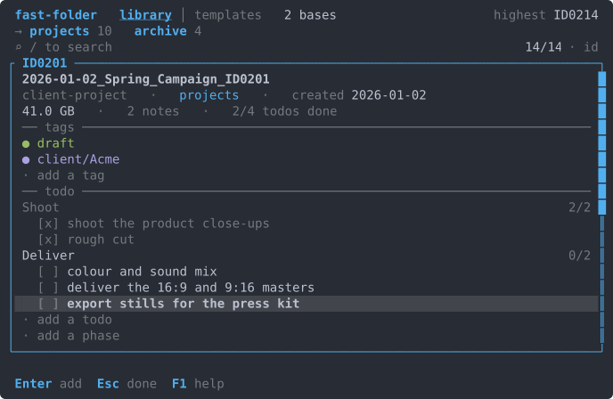

<h1 align="center">fast-folder</h1>

<p align="center"><b>Template-based project folders, created and managed from your terminal. Start a project in seconds, then find, jump to and organize any of them with a keystroke. Every project is numbered, across all your drives.</b></p>

<p align="center">
  <a href="https://github.com/cristocola/fast-folder/actions/workflows/ci.yml"></a>
  <a href="https://github.com/cristocola/fast-folder/releases"></a>
  <a href="https://aur.archlinux.org/packages/fast-folder"></a>
  <a href="LICENSE"></a>
  <a href="https://www.rust-lang.org/"></a>
</p>

If you work with many projects and many clients, you end up managing a lot of folders and files. fast-folder gives you one place to create them and one place to find, open, move and copy them afterwards.

You describe a folder structure once as a template. Every project you make from it comes out the same way: a consistent name, the subfolders you always need, starter files with your answers already written inside them, a unique ID, and a small metadata file that lets you find the project again months later.

Day to day you work in a full screen terminal app that shows your whole library at once and acts on it. Everything the app can do also has a command, so the same work fits into a script, a cron job, or a hotkey on your desktop. The command is `fastf`.

<p align="center"></p>

## Quick start

```bash
# Any Linux: downloads the binary and puts it on your PATH
curl -fsSL https://raw.githubusercontent.com/cristocola/fast-folder/main/packaging/linux/install.sh | sh

# Arch Linux
paru -S fast-folder-bin

# Your first project
fastf                        # pick a template, fill the form, done
```

Two templates are installed on first run. `general` is ready to use straight away and gives you a dated, numbered folder with an inbox inside it. `client-project` adds working and delivery folders plus a brief that fills itself in with the client's name and the project details.

More templates for specific kinds of work live in the [`examples/templates/`](examples/templates/) gallery: `music-video`, `photography`, `video-production`, `rust-project`, `python-project`, `web-project`, `finance-monthly` and `research-note`. Copy any folder into your own templates directory to adopt it, then edit it to match how you work.

## What it does

- **Creates a whole project from a template.** One template describes the folder tree and the starter files. Answering a few questions produces the folder, the subfolders, and files with your answers written into them: a brief with the client's name in it, a shot list titled for the artist, a report header with the right month, a config ready to build. Text files get their placeholders filled in, and binary files such as a logo or a video asset are copied byte for byte.
- **Finds any project again.** Every project carries a unique ID, a creation date, tags and searchable metadata. `fastf open ID0047` opens the folder, and so does `fastf open 47` or `fastf open lullaby`. In the terminal app the list narrows as you type, matching a name, an ID, a template or a tag, and a typo still finds the project. Precise filters work in both places: `fastf search template=music-video tag:draft created>2026-01-01`.
- **Stays quick on a large library.** The list appears before a single folder has been measured. Folder sizes are walked on background threads, two at a time, starting with the row you are on, and each one fills in where it belongs as it arrives. Each base keeps a small index beside its projects, so opening the app reads one file instead of walking every drive, and the index rebuilds itself from the folders whenever the two disagree.
- **Holds projects on several drives at once.** You can have different project bases for different reasons. For example a fast internal drive for current work, an external drive for archived projects, a network share, or a folder that another operating system on the same machine also mounts. Point fast-folder at each of them and they become one library, with a column that says which base a project is on. When a drive is unplugged, its projects are skipped, and they come back when you plug it in again.
- **Moves and copies projects safely.** `fastf move` uses a filesystem rename when both ends are on the same drive, which takes the same instant however large the folder is. Across drives it copies every ordinary file and every link, verifies every path, type, byte length and link target against a manifest, confirms the source is unchanged, publishes the destination with an atomic rename, and only then takes the original out of the library in one step and removes it — so an interruption can never leave half a project behind. Before copying anything it checks that the move could finish: that it can write in the source base, that the target has room, and that every name fits there. `fastf copy-to` does the same work and keeps the original, which is how a project goes onto a backup drive with its ID intact.
- **Opens projects in the tools you already use.** Reveal a folder in your file manager, open a terminal inside it, put its path on the clipboard, or print the path on stdout for `cd "$(fastf path api)"`. Bind fast-folder to a hotkey on your desktop and it opens a terminal for itself when a question needs an answer.
- **Keeps the filesystem as the single source of truth.** A folder is a project because it contains a `PROJECT_INFO.md` file. Move it with your file manager, rename it, or copy it to another drive, and it stays the same project; `fastf reindex` picks up whatever you did outside the app. Delete the folder and the project goes with it.
- **Adopts folders you already have.** `fastf register` writes the metadata into work that came from somewhere else, one folder at a time or a whole directory at once. `fastf apply` adds a template's missing folders and files to a folder that already exists.
- **Reads a template out of a finished project.** `fastf template from-folder` looks at a project you are happy with and writes the template that would produce it.
- **Keeps a record of each project.** Tags group projects across templates and bases. Every project keeps dated notes, as many lines as a note needs, and a todo list grouped into phases such as shoot, edit and deliver. Both are plain Markdown in the project's `PROJECT_INFO.md`, so any editor can change them, and the app shows the change within a second. A template can hand every new project the checklist its kind of work always starts with.
- **Runs your own steps after creating a project.** It can open the new folder, start your editor, initialize a git repository, or run any command you give it.
- **Works on Linux and Windows.** Templates use `/` on every platform. Paths are checked before anything is written, so a template can only ever produce files inside the project it belongs to.

fast-folder is a tool for one person, working on ordinary files and directories on one computer. It reads and writes files on the machine it runs on. The terminal app and the command line share the same configuration, templates and counters, so the two stay in step.

## The terminal app

Running `fastf` on its own opens the app: one full screen dashboard over the whole library, every base, every project, folder sizes filling in as they arrive. Typing narrows the list and a typo still finds the project; every verb has a key, `Enter` opens the action menu, `c` opens a command palette, and `?` lists every key that works where you are. The detail pane is an editor you step into with `→`: tags, a todo list, dated notes and template variables, read from the project's file as it is on disk. It sits beside the list, under it, or in its place, whichever the window has room for. Creating a project, adopting a folder and applying a template are one shape, a form, a preview and Enter, and templates have a tab of their own with a builder and a built-in guide. It runs in any terminal of 40×12 or more, draws in Doom One wherever the terminal has 24-bit colour (or sixteen colours, or plain ASCII), never takes the mouse, and moves only to show what just changed. Every key and every screen is in [docs/app.md](docs/app.md).

### Todos

Every project's todo list is in its pane, grouped under the phases the file gives it, each phase with how much of it is done. Enter ticks a todo and ticks it back. F2 opens its words where they sit, to fix a typo or to empty and remove it. `+` opens a line inside the list, in the phase the cursor is in, and Enter writes the todo and opens the next line under it, so a whole list is typed in one go. Paste a checklist from a brief or a message onto that line and every line of it becomes a todo, the `- [ ]` boxes and numbers taken off. The same three keys mean the same thing everywhere in the app: Enter acts, F2 edits, `+` adds.

<p align="center"></p>

`<` and `>` step to the previous or next project without leaving the pane, staying on its todos, so a morning's review of every open list is a key per project.

## The command line

Every action in the app has a command, including `rename`, `unregister`, `delete`, `move` and `copy-to`. Output goes to stdout so it pipes and redirects cleanly, and the questions the command line asks are drawn in a few rows at the cursor, leaving whatever it printed above them on screen.

```bash
fastf new general --name="spring campaign"   # 2026-07-16_Spring_Campaign_ID0048/
fastf recent --tag draft                     # what you were working on
fastf recent --base archive                  # one base at a time
fastf search ariana                          # plain text
fastf search template=music-video tag:draft  # exact filters
fastf open 47                                # reveal the folder
cd "$(fastf path api)"                       # the bare path, for a shell
fastf move ID0047 archive                    # into another base
fastf copy-to ID0047 /mnt/backup             # onto a backup drive, ID kept
fastf tag add ID0047 delivered
fastf note add ID0047 "sent the rough cut"   # a dated note; stdin and $EDITOR take several lines
fastf notes ID0047 --since 2026-07           # every note since July, every line of each
fastf todo add ID0047 "colour pass" --phase Edit
fastf todo list ID0047                       # numbered, grouped by phase
fastf todo done ID0047 3                     # tick it; --undo opens it again
fastf todo edit ID0047 3 "colour and grade"  # reword it
fastf todo remove ID0047 3
```

The whole tool is one binary of a few megabytes that carries everything it needs. Install it from a package manager, or keep it in a folder on a USB stick and take it with you. The full command reference is [docs/cli.md](docs/cli.md).

## Installation

### Any Linux

```bash
curl -fsSL https://raw.githubusercontent.com/cristocola/fast-folder/main/packaging/linux/install.sh | sh
```

The script downloads the statically linked release archive, checks it against
the release's own `SHA256SUMS`, and unpacks the binary along with the man
pages, the completions for bash, zsh and fish, the desktop entry and the icons.

**It puts `fastf` on your PATH for you.** If you can use `sudo`, it asks once:

- **`/usr/local`**, the default: `fastf` works straight away, in the terminal
  you ran the script from and in the app menu. `sudo` asks for your password.
- **`~/.local`**: just for you, no password. It adds `~/.local/bin` to your
  shell profile, so `fastf` works in every terminal you open after that.

Without `sudo`, or when there is no terminal to ask in, it uses `~/.local`. As
root, and whenever `~/.local/bin` is already on your PATH, it installs without
asking. Running it again updates the copy you already have, wherever that is.

Read it before you run it, as with any script from the internet:
[`packaging/linux/install.sh`](packaging/linux/install.sh). To read your copy
first, download it, look at it, then run it:

```bash
curl -fsSLO https://raw.githubusercontent.com/cristocola/fast-folder/main/packaging/linux/install.sh
less install.sh
sh install.sh
```

`FASTF_INSTALL=system` or `FASTF_INSTALL=user` answers the question in
advance, `FASTF_VERSION=vX.Y.Z` pins a release, and `PREFIX=/opt/fastf` chooses
somewhere else entirely. Pass them to the `sh` end of the pipe:
`curl … | FASTF_INSTALL=user sh`. To remove it later, delete `fastf` from the
`bin` directory it went into, the `fastf` and `fast-folder` files under
`share`, and, for a `~/.local` install, the two lines the script marked in your
shell profile.

### Arch Linux (AUR)

```bash
paru -S fast-folder-bin    # the prebuilt static binary
paru -S fast-folder        # build it from source
```

Both install the `fastf` command, shell completions, man pages, and a "Fast Folder" app menu entry that opens the terminal app.

### Windows

Download the `.msi` installer from the [releases page](https://github.com/cristocola/fast-folder/releases) and run it. It installs `fastf.exe` and adds it to your PATH. A portable `.zip` is also available. Full instructions, including manual PATH setup, are in [docs/windows.md](docs/windows.md).

### Build from source

Works on Linux, macOS and Windows. Install Rust with [rustup](https://rustup.rs), then:

```bash
git clone https://github.com/cristocola/fast-folder.git
cd fast-folder
cargo build --release
install -Dm755 target/release/fastf ~/.local/bin/fastf   # or copy fastf.exe onto your PATH
```

On macOS the source build above is how you install it.

Every release archive is listed in `SHA256SUMS` and carries a signed build provenance attestation, which `gh attestation verify <file> --repo cristocola/fast-folder` checks.

## Where fast-folder keeps its data

Configuration and templates live together in one data folder: `$FASTF_INSTALL_DIR` if set, else the binary's own directory when a `config.toml` sits beside it (portable mode), else `~/.config/fastf` or `%APPDATA%\fastf`. `fastf paths` shows yours. The ID counter lives with your projects, as a `.fastf-counter.toml` in each base, so every operating system that mounts the drive reads the same number. Details in [docs/config.md](docs/config.md).

## Documentation

| Guide | Contents |
|---|---|
| [docs/app.md](docs/app.md) | The guided app: the dashboard, every key, search, the flows, the templates tab, settings |
| [docs/cli.md](docs/cli.md) | The command reference: create, browse, search, tags, notes, register, move, copy, templates |
| [docs/config.md](docs/config.md) | Settings, environment variables, where the data lives, the ID counter |
| [docs/templates.md](docs/templates.md) | Template authoring: `template.yaml`, variables, transforms, tokens, the builder, the guide |
| [docs/projects.md](docs/projects.md) | The project model: `PROJECT_INFO.md`, discovery, bases, safe moves, copies, crash recovery, what fastf promises |
| [docs/windows.md](docs/windows.md) | Windows install, PATH setup, the console |

## Contributing

```bash
cargo test                                # the whole suite
cargo clippy --all-targets -- -D warnings
cargo fmt --check
```

Tests are hermetic: they redirect all state through `FASTF_INSTALL_DIR` and `HOME` into temporary directories, so a real install stays untouched. [`tests/CLAUDE.md`](tests/CLAUDE.md) says what each suite guards and the rules a new one must follow; the three things worth knowing before you change the copy or move paths:

- **Fault injection.** Boundaries that must survive a crash carry named failpoints. Trip one with `FASTF_FAULT=move:before-commit-rename` to return an error there, or `FASTF_FAULT=create:mid-copy:abort` to kill the process there. The list is `util::faults::ALL_FAULT_POINTS`. Release builds compile them out.
- **Work counting.** Operations that cost real I/O name themselves, so a claim such as "a tag patches its row and leaves the rest of the library alone" can be asserted. `FASTF_TRACE_FILE=/tmp/counts fastf` appends one line per traced operation. Release builds compile this out too.
- **Lint the other platform.** `#[cfg(unix)]` code compiles on unix and `#[cfg(windows)]` code compiles on Windows, so run `cargo clippy --all-targets --target x86_64-pc-windows-gnu` from Linux (or `--target x86_64-unknown-linux-gnu` from Windows) to see what your local clippy misses. CI lints on both platforms in any case.

What is still open is in [ROADMAP.md](ROADMAP.md). Pull requests are welcome; please make sure the checks above pass first.

## License

[MIT](LICENSE) © 2026 Cristo Cola
